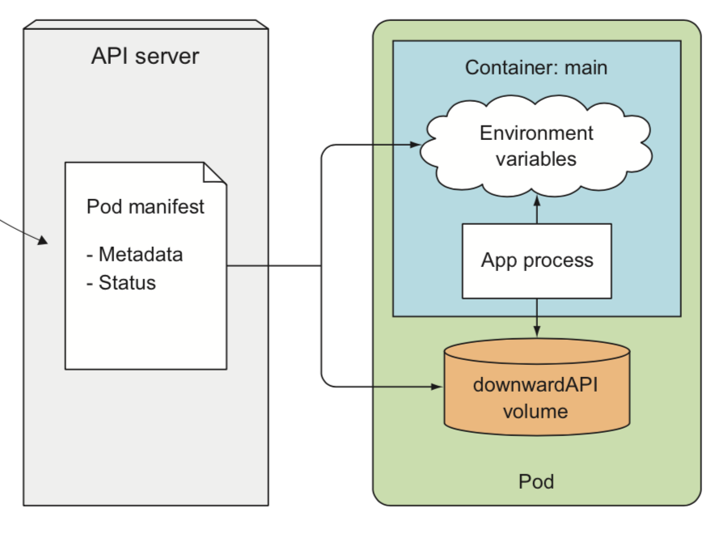
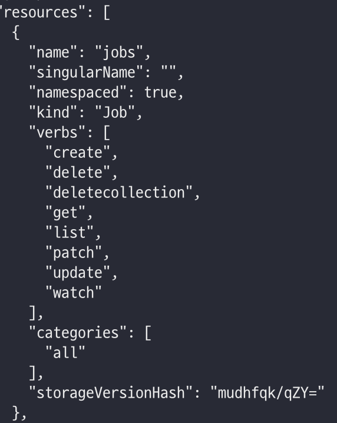
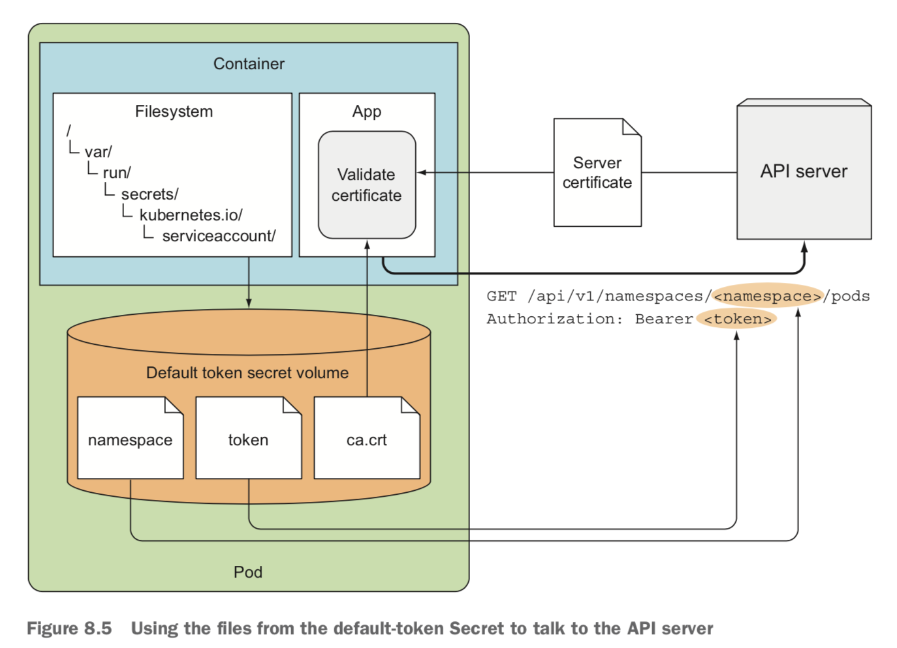
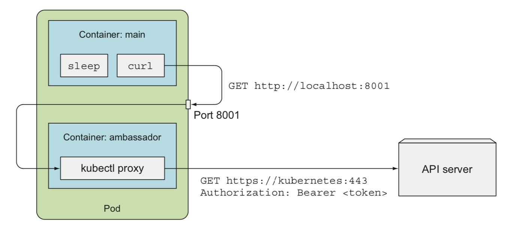

# 08. 애플리케이션에서 파드 메타데이터와 그 외의 리소스에 엑세스하기

### 목차
- downward API
  - 환경변수로 노출
  - 볼륨으로 노출
- 쿠버네티스 API
  - 로컬에서 proxy로 통신
  - 파드 내에서 인증을 거쳐 통신
  - 파드 내에서 앰배세더 패턴으로 통신

---

- 파드의 실행 이전에 알수 없는 데이터 (ex. IP, 노드 이름, 파드 이름...)
- 이미 리소스 정의 파일에 설정된 데이터 (ex. 파드 레이블, 어노테이션...)

애플리케이션에 어떻게 전달해야할까

---

## Downward API



- 쿠버네티스에서 알아서 호출함
- 환경변수와 볼륨 파일에 데이터가 채워지는 형태

---

## [사용가능한 메타데이터들](https://kubernetes.io/docs/tasks/inject-data-application/downward-api-volume-expose-pod-information/#capabilities-of-the-downward-api)
- 파드 이름
- 파드 IP주소
- 파드가 속한 네임스페이스
- 파드가 속한 노드 이름
- *파드가 속한 서비스 어카운트 이름* (12장)
- *각 컨테이너의 CPU와 메모리 request와 limit* (14장)
- **파드의 레이블** - 볼륨으로만 노출
- **파드의 어노테이션** - 볼륨으로만 노출
- ...

---

## 환경변수로 메타데이터 노출
*예제: downward-api-env.yaml*

```yaml
    env:
    - name: POD_NAME
      valueFrom:
        fieldRef:
          fieldPath: metadata.name 
          # 파드 메니페스트의 metadata.name을 참조하겠다.
```

```bash
# create
k create ~~~
# downward pod에 env 채워졌는지 확인
k exec downward env
```
---

## 볼륨에 파일로 메타데이터 전달
- downwardAPI 유형 볼륨
- 환경변수로는 파드의 레이블, 어노테이션을 노출할 수 없으므로 볼륨을 사용해야함

---

*예제: downward-api-volum.yaml*

```yaml
 volumes:
  - name: downward
    downwardAPI:
      items:
      - path: "podName"
        fieldRef:
          fieldPath: metadata.name
          # podName 파일에 파드 이름을 기록한다.
```
---

컨테이너 메타데이터 참조
```yaml
      - path: "containerCpuRequestMilliCores"
        resourceFieldRef:
          containerName: main
          # 참조하는 컨테이너 이름 명시해야한다.
          resource: requests.cpu
          divisor: 1m
```
---

```bash
# create
k create ~~~
# downwardAPI volum 채워졌는지 확인
k exec downward-vol -- ls -l /etc/downward
# 레이블파일 확인
k exec downward-vol cat /etc/downward/labels
# 어노테이션파일 확인
k exec downward-vol cat /etc/downward/annotations
```
---

### 레이블과 어노테이션 업데이트 
(환경변수말고 볼륨 쓰는게 좋은 이유)

파드 실행 중 **레이블**이나 **어노테이션** 업데이트하면 
해당 값을 가진 파일도 업데이트 된다.

환경변수로 쓰고 있다면 자동으로 업데이트 되지 않는다.

---

# 쿠버네티스 API 서버와 통신
서비스, 파드에 관한 정보는 어느정도 얻을 수 있지만 
다른 리소스들의 정보는 어떻게 접근할까

---

## [쿠버네티스 REST API](https://kubernetes.io/ko/docs/concepts/overview/kubernetes-api/)

```bash
# API 서버 url얻기
k cluster-info

# HTTPS 인증 알아서 해주는 프록시로 로컬에서 API 서버 접근하기
k proxy

curl localhost:8001
# 반환된 경로 목록 확인하기

# job리소스에 관련된 API 살펴보기
curl localhost:8001/apis/batch
# 사용가능한 버전 확인

# 특정 버전을 붙여보기
curl localhost:8001/apis/batch/v1
# 리소스 목록 확인
# name 이 요청가능한 엔드포인트
```
---

 

---
```bash
# 클러스터의 잡 목록 얻기 - get요청
curl localhost:8001/apis/batch/v1/jobs

# 잡 리소스 만들고 다시 해보기
k create my-job.yaml
curl localhost:8001/apis/batch/v1/jobs

# 특정 잡을 반환하기
curl localhost:8001/apis/batch/v1/namespaces/default/jobs/my-job
```
---

## 파드 내에서 API 서버와 통신
kubectl proxy를 쓸수 없는 파드 내에서는

1. API 서버 주소 찾기
2. API 서버가 맞는지 인증하기
3. 자신을 API 서버에게 인증하기

---

**kubernetes 서비스** 조회로 API 서버의 ip주소와 포트 확인할 수 있다.
 ```bash
# API 서버를 가리키는 kubernetes 서비스 찾기
k get svc
```

---

curl 요청 보낼수 있는 파드 만들기
*예제: curl.yaml*

```bash
k create ~~

# 컨테이너에서 bash shell열기
k exec curl -it bash

# 환경변수를 통해 서비스 정보 확인하기
env | grep KUBERNETES_SERVICE

# DNS로 서비서 정보 확인하기
curl https://kubernetes
```
---

API서버 인증서 검사하기
```bash
# 인증서가 들어있는 시크릿 볼륨 확인
ls /var/run/secrets/kubernetes.io/serviceaccount

# CA 인증서를 지정하여 다시 API서버에 요청
curl --cacert /var/run/secrets/kubernetes.io/serviceaccount/ca.crt https://kubernetes

# CURL_CA_BUNDLE 환경변수 설정으로 --cacert생략
export CURL_CA_BUNDLE=/var/run/secrets/kubernetes.io/serviceaccount/ca.crt

# 서버 신뢰 o but 클라이언트는 신뢰 x
curl https://kubernetes
```
---

[API서버에게 클라이언트 인증](https://kubernetes.io/docs/reference/access-authn-authz/authentication/)
```bash
# 토큰이 들어있는 시크릿 볼륨 확인
ls /var/run/secrets/kubernetes.io/serviceaccount

# 토큰을 환경변수에 저장
export TOKEN=$(cat /var/run/secrets/kubernetes.io/serviceaccount/token)

# 최종 요청
curl -H "Authorization: Bearer $TOKEN" https://kubernetes
```

gcloud는 역할 기반 액세스 제어가 되어있어서 우회가 필요하다.

```bash
(sudo) kubectl create clusterrolebinding permissive-binding --clusterrole=cluster-admin --group=system:serviceaccounts
```
---
파드가 실행 중인 네임스페이스 얻기
```bash
# 네임스페이스가 들어있는 시크릿 볼륨 확인
ls /var/run/secrets/kubernetes.io/serviceaccount

# 네임스페이스를 환경변수에 저장
export NS=$(cat /var/run/secrets/kubernetes.io/serviceaccount/namespace)

# 네임스페이스에 속한 파드 조회
curl -H "Authorization: Bearer &TOKEN" https://kubernetes/api/v1/namespaces/$NS/pods
```

---
default-secret 시크릿 파일로 API서버와 통신하기
 

---
## 앰배서더 컨테이너를 이용한 API 서버 통신 간소화

앰배세더 컨테이너(프록시) 패턴


- kubectl proxy를 쓸수 있는 컨테이너를 만들어서 요청을 대신하도록한다. 
- 파드내의 컨테이너는 동일한 네트워크 인터페이스를 공유한다.

---
*예제: curl-with-ambassador.yaml*

```bash
k create ~~

# main 컨테이너에 입장
k exec -it curl-with-ambassador -c main bash

# 프록시를 통한 통신 
curl localhost:8001
```

---

## 클라이언트 라이브러리 사용해 API 서버와 통신
- 애플리케이션 상에서 쿠버네티스 리소스 CRUD 하는 인터페이스들 제공
- 여러 언어에 대한 [라이브러리](https://kubernetes.io/docs/reference/using-api/client-libraries/)

---

### 스웨거와 OpenAPI 사용해 나만의 라이브러리 만들기

- 쿠버네티스 API 서버는 아래 엔드포인트로 api 스펙을 공개함
```
/swaggerapi - 스웨거 API 정의
/swagger.json - OpenAPI 스펙
/swagger-ui - 웹ui 제공
```
but, GKE 에서는 openAPI 스펙을 `/openapi/v2`로 제공하고 스웨거 ui는 따로 제공하지 않음
