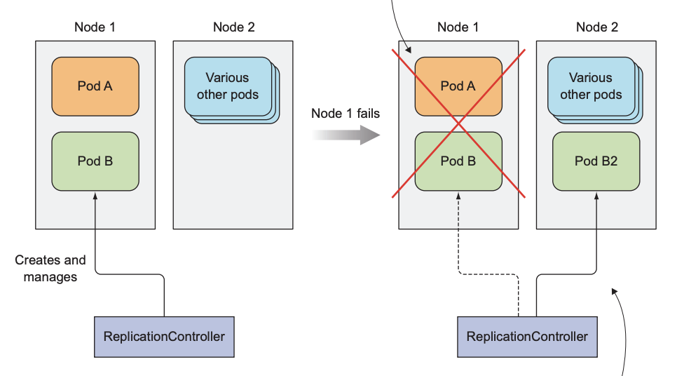
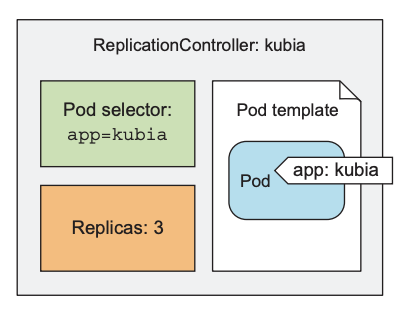
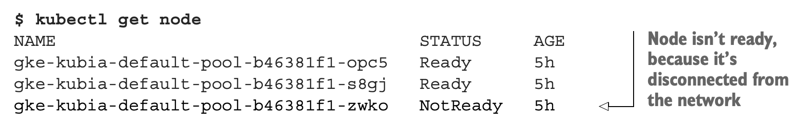
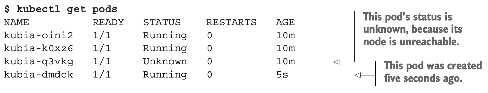
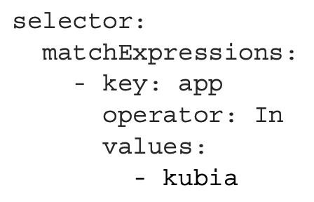
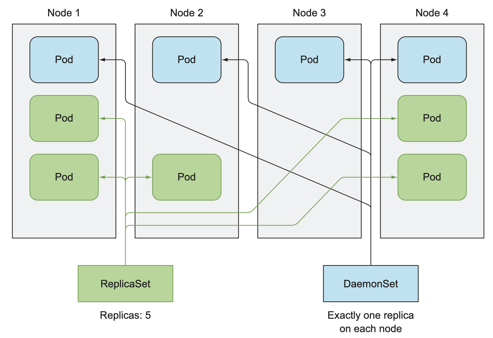
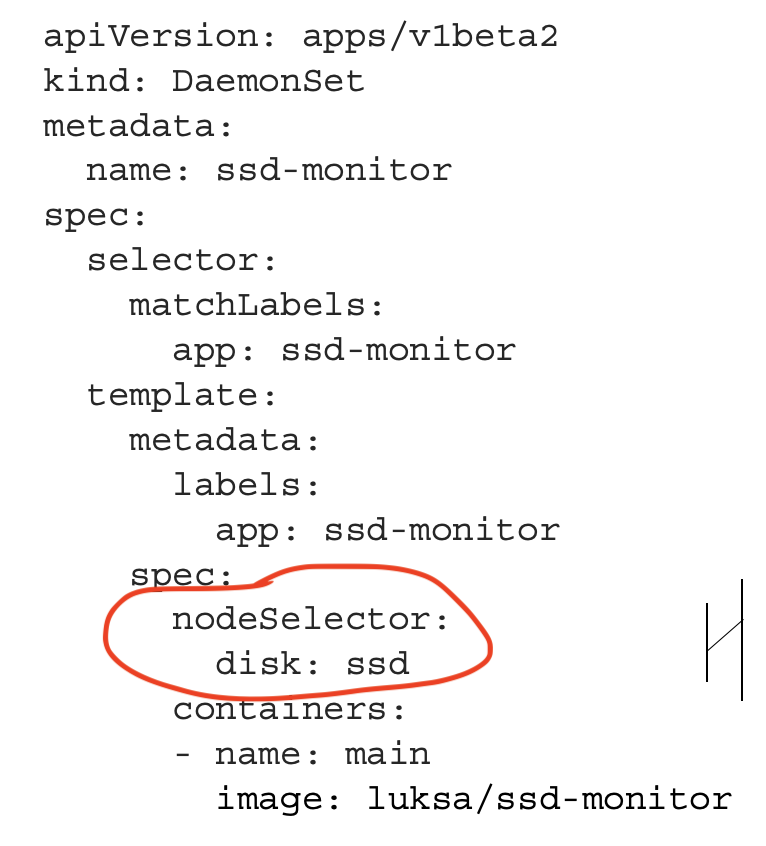
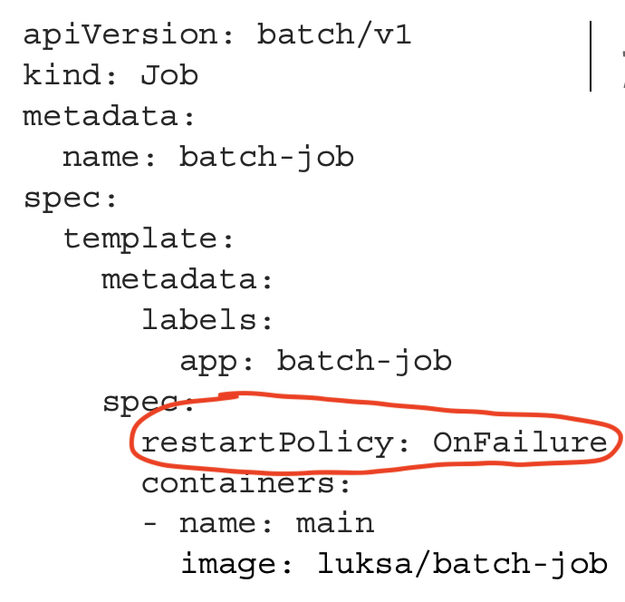
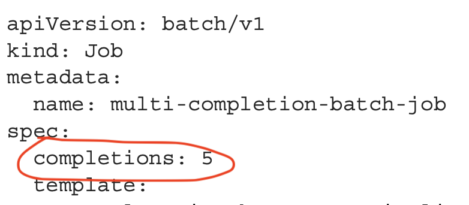
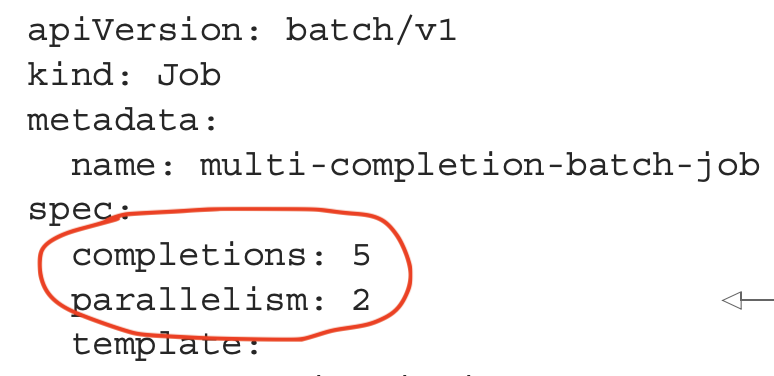

# 04. 레플리케이션과 그 밖의 컨트롤러 - 관리되는 파드 배포

---

### 목차
- 라이브니스 프로브
- 레플리케이션 컨트롤러
- 레플리카셋
- 데몬셋
- 잡 리소스
- 잡 스케줄링

---

# 파드를 안정적으로 유지하기
쿠버네티스에 컨테이너 목록을 제공함으로써 컨테이너가 계속 살아있도록 관리할 수 있다.
파드가 노드에 스케줄링 되는 즉시, 해당 노드의 **kubelet**은 컨테이너를 실행하고 관리한다. 
ex) 프로세스 crash 발생 시 컨테이너를 재실행한다.

만약 애플리케이션 내부적으로 재실행이 필요한 상태라면 어떻게 알아챌까?

---

## 라이브니스 프로브 (liveness probe)
파드의 스펙에 각 컨테이너의 라이브니스 프로브를 지정할 수 있다.
파드 호스팅 노드의 Kubelet은 주기적으로 프로브를 실행하고 실패하면 컨테이너를 재실행한다.

---

## 라이브니스 프로브의 3가지 메커니즘

1. HTTP GET 프로브
    - IP 주소, 포트, 경로를 지정하면 주기적으로 GET 요청 수행
    - 응답코드가 오류이면 컨테이너 재실행 
2. TCP socket 프로브
    - 지정된 포트에 TCP연결 시도, 실패하면 재실행
3. Exec 프로브
    - 컨테이너 내의 임의 명령을 실행하고 명령의 종료 상태코드가 0이 아니면 재실행

---

## HTTP기반 라이브니스 프로브 생성
웹 애플리케이션은 웹서버가 요청 처리하는지 체크하는게 좋다.

*예제코드: kubia-liveness-probe.yaml*
```yaml
apiVersion: v1
kind: Pod
metadata:
  name: kubia-liveness
spec:
  containers:
  - image: luksa/kubia-unhealthy
    name: kubia
    livenessProbe:
      httpGet:
        path: /
        port: 8080
```

---

## 동작 중인 라이브니스 프로브 확인

```bash
# 파드 RESTARTS 확인
$ kubectl get po kubia-liveness

# 종료된 컨테이너의 로그 확인
$ kubectl logs kubia-liveness --previous

# 컨테이너가 재실행된 이유 확인
$ kubectl describe po kubia-liveness

# Exit Code: 137
# 137 = 128 + x(프로세스에 전송된 시그널 번호)
# SIGKILL(9) or SIGTERM(15)
# 해석: 프로세스가 쿠버네티스에서 보낸 외부 신호에 의해 종료됨
```

---

## 라이브니스 프로브의 추가 속성 설정
```
Liveness: http-get http://8080/ delay=0s timeout 1s period=10s #success=1 #failure=3
```

```
initialDelaySeconds: 5      
periodSeconds: 5
failureThreshold: 1
```
대부분 애플리케이션은 컨테이너 시작과 동시에 요청을 받을 준비가 되어있지 않다. 
이를 고려하여 초기 지연을 설정해야 한다.

---

## 효과적인 라이브니스 프로브 생성
- 실행 중인 파드는 반드시 라이브니스 프로브를 정의해야 한다.
- 특정 URL(ex '/health')에 요청하도록 프로브를 구성하여 모든 요소를 한번에 확인해라.
- endpoint에 인증이 필요한지 주의해야한다.
- 프로브로 앱의 내부만 체크하고 외부요인의 영향을 받아서는 안된다.
    - 프론트엔드 웹서버에서 백엔드 DB에 연결 불가 시 프로브가 실패해서는 안된다. 
- 프로브는 자주실행해야하고, 1초 내에 완료되어야 한다.
- 컨테이너가 사용할수 있는 CPU시간에 프로브의 CPU시간도 포함되므로 연산 최소화 필요하다.

---

직접 생성한 파드는 Kubelet에서만 관리한다.
Kubelet은 노드에서 실행되므로 노드 자체가 크래시되면 노답이다.

노드 자체에 크래시가 발생한 경우, 노드의 모든 파드를 새로 시작해야하는 것은 **컨트롤 플레인**의 몫

---

# 레플리케이션 컨트롤러
마스터에서 실행하는 쿠버네티스 컨트롤 플레인 리소스
클러스터에서 노드가 사라지거나,
노드에서 파드가 사라지면
교체 파드를 생성한다.

---

rc에 의해 관리되는 파드는 노드 장애로 인해 사라지면 복제 파드가 다른 노드에 생성된다.



---

## 레플리케이션 컨트롤러의 동작

실행 중인 파드 목록을 지속적으로 모니터링한다.
특정 레이블의 파드 수가 의도하는 수와 일치하는지 확인한다.
의도보다 적거나 많이 실행되는 경우 파드를 추가하거나 삭제한다.
추가되는 파드는 복제본으로 완전히 새로운 인스턴스이다.

---

## 레플리케이션 컨트롤러의 3가지 요소

- 레이블 셀렉터: 레플리케이션 컨트롤러가 관리할 파드를 결정
- 레플리카 수: 실행 할 파드 개수
- 파드 템플릿: 파드 레플리카를 만들 때 사용함, 변경해도 기존 파드에는 영향없음



---

## 레플리케이션 컨트롤러 생성

*예제: kubia-rc.yaml*
> 레이블 셀렉터를 지정하지 말고 쿠버네티스가 파드 템플릿에서 추출하도록 해라

---

```
apiVersion: v1
kind: ReplicationController
metadata:
  name: kubia
spec:
  replicas: 3
  selector:
    app: kubia
  template:
    metadata:
      labels:
        app: kubia
    spec:
      containers:
      - name: kubia
        image: luksa/kubia
        ports:
        - containerPort: 8080
```        
---

## 레플리케이션 컨트롤러 작동 확인

```bash
$ kubectl create -f kubia-rc.yaml  

# 파드 조회하여 몇개 생성되었나 확인
$ kubectl get pods

# 파드 한개 수동으로 삭제해보기
$ kubectl delete pod kubia-***

# 다시 조회 - 새로운 파드와 종료중 파드까지 4개 표시됨
$ kubectl get pods

# rc 정보 확인
$ kubectl get rc

# rc 세부 정보 확인
$ kubectl describe rc kubia
```

---

## 새로운 파드 생성의 원인

쿠버네티스는 리소스 및 리소스 목록의 변경을 감시한다.
rc는 삭제되는 파드에 대해 즉시 통지를 받는다.
통지를 받은 rc는 파드 수를 확인하고 적절한 조치를 취한다.

---

## 노드 장애 대응하기

노드 중 하나의 네트워크 연결 끊어보자
(미니큐브는 노드가 하나이므로 예제 수행 불가)

```bash
# 노드에 접속
$ gcloud compute ssh ***

# 네트워크 인터페이스 종료
$ sudo ifconfig eth0 down

# ssh 세션에서 나가서 노드 조회
$ kubectl get node
```

---



**NotReady** : 파드를 다시 스케줄링 하기 전 잠시 대기한다는 의미
(일시적인 네트워크 장애나 Kubelet 재시작으로 노드 접근 안되는 경우 일단 대기)

---



**Unknown** : NotReady 상태가 몇분간 지속되면 UnKnown으로 변경된다. 
이와 즉시 rc는 새 파드를 가동한다.

---

## 레플리케이션 컨트롤러의 범위 안팎으로 파드 이동하기

rc는 레이블 셀렉터와 일치하는 파드만을 관리하므로, 파드의 레이블을 변경하면 rc의 범위에서 제거되거나 추가될 수 있다. 

```bash
# 실행 중인 파드에 레이블 추가해보기
$ kubectl label pod kubia-** type=special

# 파드 조회해보기
$ kubectl get pods --show-labels

# 실행 중인 파드의 레이블 변경
$ kubectl label pod kubia-** app=foo --overwrite

# 파드 조회해보기 - 레이블 바꾼 파드는 더 이상 관리 안됨
$ kubectl get pods -L app
```

특정 파드에 작업을 하려면 이렇게 rc범위에서 빼내면 편하다.
rc의 레이블 셀렉터를 바꾸면?

---

## 파드 템플릿 변경

```bash
# rc 편짐
$ kubectl edit rc kubia
# 파드 템플릿에 레이블 추가해보기

# 파드 조회해보기
$ kubectl get pods --show-labels
```

---

## 수평 파드 스케일링

rc 리소스의 replicas 필드 값을 변경하면 된다.
```bash
# 스케일 변경 명령
$ kubectl scale rc kubia --replicas=10

# 선언적으로 변경
$ kubectl edut rc kubia
# replicas 필드 바꾸기
```

---

## 레플리케이션 컨트롤러 삭제

```bash
# rc를 삭제하면 파드도 삭제된다.
$ kubectl delete rc kubia

# rc만 삭제하고 파드는 실행상태로 둘수 있다.
$ kubectl delete rc kubia --cascade=false  
```
---

# 레플리케이션 컨트롤러 대신 레플리카셋 사옹하기
차세대 rc, 사실 항상 rs를 써야한다(!?)
일반적으로 rs를 직접 생성하지는 않고 디플로이먼트 리소스를 생성할 때 자동으로 생성된다.

---

## 레플리카셋 vs 레플리케이션 컨트롤러
rs가 더 풍부한 레이블 셀렉터 표현식을 사용할 수 있다.
- 특정 레이블이 없는 파드
- 특정 레이블의 키가 있는 파드
- 여러개의 레이블 매칭

---

## 레플리카셋 정의하기

*예제: kubia-replicaset.yaml*
> rs 리소스 정의와 거의 동일, **selector.matchLabels**에 레이블 정의

---

```yaml
apiVersion: apps/v1
kind: ReplicaSet
metadata:
  name: kubia
spec:
  replicas: 3
  selector:
    matchLabels:
      app: kubia
  template:
    metadata:
      labels:
        app: kubia
    spec:
      containers:
      - name: kubia
        image: luksa/kubia
```
---

## 레플리카셋 생성 및 검사

```bash
# 생성
$ kubectl create -f kubia-replicaset.yaml

# 조회 
$ kubectl get rs

# 세부정보 조회
$ kubectl describe rs
```
---

## 레플리카셋의 레이블 셀렉터 사용하기

*예제: kubia-replicaset-matchexpressions.yaml*




**operator**
- In: values 중 하나와 일치
- NotIn: values와 일치하지 않는 파드 선택
- Exists: key가 있는 파드를 선택 (values를 지정하면 안됨)
- DoesNotExist: key가 없는 파드만 선택

---

## 레플리카셋 정리

```bash
# 삭제
$ kubectl delete rs kubia
```
---

# 데몬셋을 사용해 각 노드에서 한 개의 파드 실행하기
클러스터의 모든 노드에서 실행되어야 하는 인프라 관련 파드는 어떻게 관리할까?
ex) 로그수집기, 리소스 모니터, [kube-proxy 프로세스](https://kubernetes.io/ko/docs/concepts/cluster-administration/proxies/)

일반적으로는 노드가 부팅되는 동안 시스템 초기화 스크립트 or [systemd 데몬](https://slow-and-steady-wins-the-race.tistory.com/147)을 통해 실행한다.

---

## 데몬셋으로 모든 노드에 파드 실행하기
데몬셋에 의해 생성되는 파드는 타깃 노드가 지정되어있고, 쿠버네티스 스케줄러를 건너뛴다. 
즉 무조건 타깃 노드에 하나의 파드는 생성된다.



---

데몬셋은 파드 셀렉터와 일치하는 파드가 각 노드에서 실행중인지 확인한다. 
노드가 다운되어 파드가 한 개 없어지면, 새 노드가 추가될때까지 기다린다.
노드가 추가되면 파드 템플릿으로 새 인스턴스를 만들어 배포한다.

---

## 데몬셋으로 특정 노드에서 파드 실행하기
파드 템플릿에서 **node-Selector**속성 지정하면 특정 노드에서 파드를 실행할수 잇다.

*예제: ssd-monitor-daemonset.yaml*


---

```bash
# 노드에 레이블 추가하기
$ kubectl get node
$ kubectl label node ** disk=ssd

# 생성
$ kubectl create -f ssd-monitor-daemonset.yaml

# ds 조회 
$ kubectl get ds

# pod 조회
$ kubectl get po

# 노드 레이블 제거하기
$ kubectl label node minikube disk=hdd --overwrite

# pod 조회 - 파드 종료중임
$ kubectl get po

# 데몬셋 삭제 - 파드도 삭제
$ kubectl delete ds
```

---

# 완료 가능한 단일 태스크를 수행하는 파드 실행
프로세스가 완료되면 종료되는 컨테이너를 만들고 관리하고 싶다.

---

## 잡 리소스 
컨테이너 프로세스가 완료되면 컨테이너를 종료한다.
노드에 장애 말생 시, 복제 교체 파드를 다른 노드로 다시 스케줄링한다.

---

## 잡 리소스 정의

*예제: batch-job.yaml*


프로세스 종료 시 수행할 작업 
restartPolicy: Always(default) | onFailure | Never

---

## 파드를 실행한 잡 보기


```bash
# job 리소스 생성
$ kubectl create -f batch-job.yaml

# 조회 
$ kubectl get jobs

# pod 조회 (완료된 파드도 모두 조회)
$ kubectl get po -a

# 종료만 되고 삭제는 안된 파드의 로그 조회
$ kubectl logs **

# 완료된 잡 조회
$ kubectl get job

# 잡 삭제 - 파드도 삭제
$ kubectl delete job
```

---

## 잡에서 여러 파드 인스턴스 실행하기
순차로 여러 파드를 실행하도록 잡 구성하기

*예제: multi-completion-batch-job.yaml*


---

병렬로 여러 파드를 실행하도록 잡 구성하기

*예제: multi-completion-parallel-batch-job.yaml*


```bash
# job 리소스 생성
$ kubectl create -f multi-completion-parallel-batch-job.yaml

# pod 조회
$ kubectl get po
```
---

## 잡 파드 완료 시간 제한하기
프로세스 완료까지 무한정 기다리나?

**spec.activeDeadlineSeconds** : 파드의 실행시간 제한, 초과 시 실패
**spec.backoffLimit**: 실패 이전에 재시도 할 횟수, 기본값 6

---

# 잡 스케줄링
batch 잡을 특정 시간에 주기적으로 실행해야 한다.

---

## 크론잡 생성

*예제: cronjob.yaml*
```yaml
apiVersion: batch/v1
kind: CronJob
metadata:
  name: batch-job-every-fifteen-minutes
spec:
  schedule: "0,15,30,45 * * * *"
  jobTemplate:
    spec:
      template:
        metadata:
          labels:
            app: periodic-batch-job
        spec:
          restartPolicy: OnFailure
          containers:
          - name: main
            image: luksa/batch-job

```

---

**spec.schedule**
- 분, 시, 일, 월, 요일
- "0,15,30,45 * * * *" | 15분마다
- "0,30 * 1 * *" | 매달 1일에 30분마다
- "0 3 * * 0" | 일요일 3am 마다

**spec.startingDeadlineSeconds**
- 예정된 시간과 실행 되는 시간의 오차범위

---

## 스케줄된 잡의 실행 방법

주의사항
- 크론잡이 여러개의 잡을 동시에 생성할 수도 있다.
    - 멱등성(여러번 실행해도 원하는 결과가 나오도록) 보장해야한다.
- 크론잡이 잡을 생성하지 않을 수 있다.
    - 다음 번 잡이 실행될때 이전의 실행에서 완료해야 하는 작업이 있다면 수행한다.
