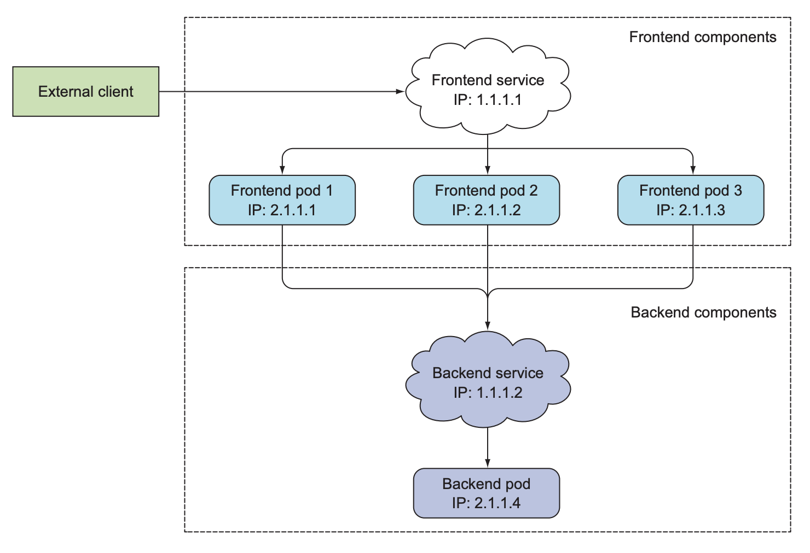
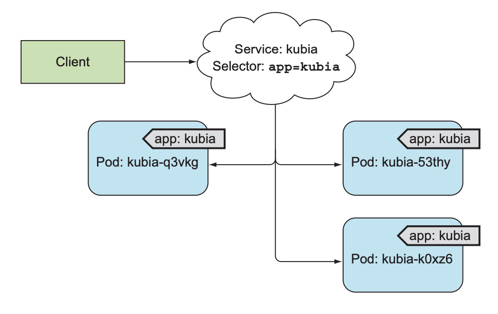
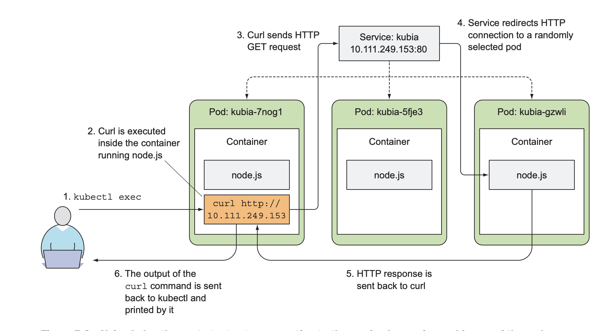
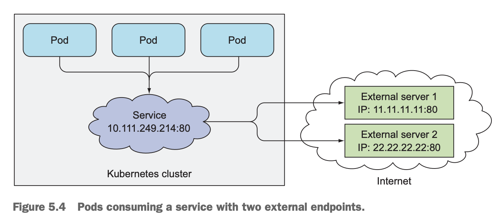
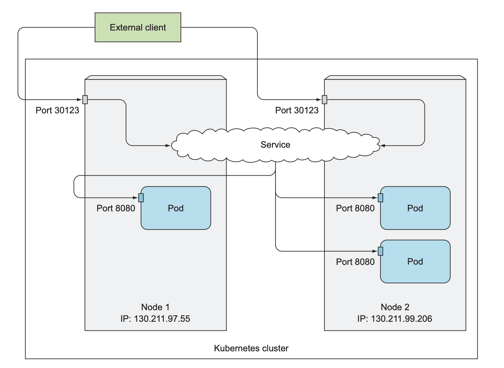
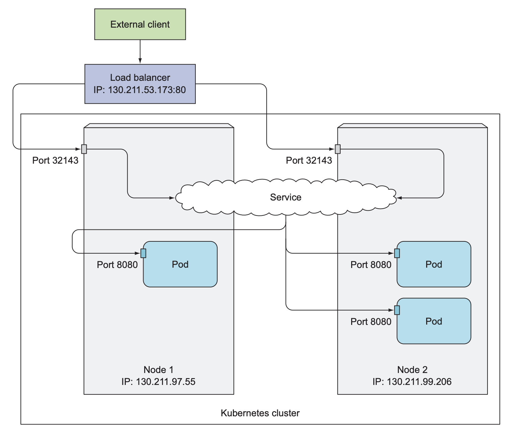
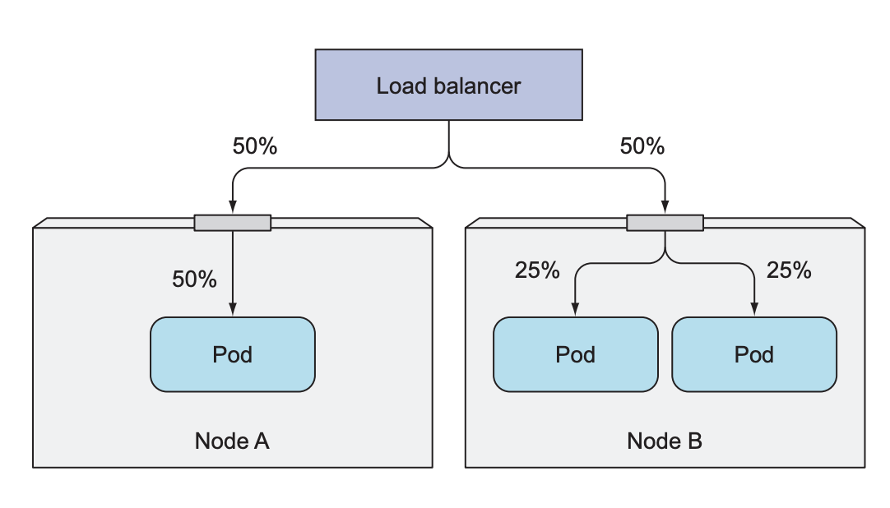
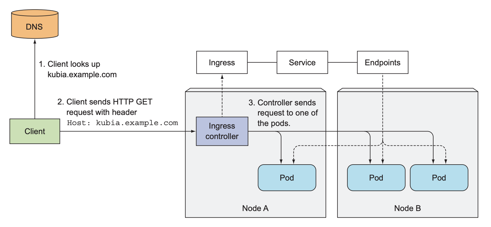
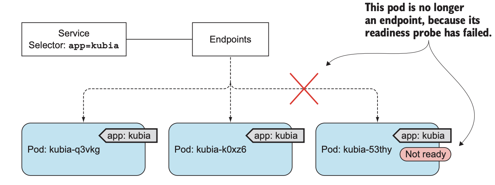

# 05. 서비스 - 클라이언트가 파드를 검색하고 통신하게 함

---

### 목차
- 클러스터 내의 파드에 요청
    - 서비스 리소스
    - 엔드포인트 리소스
- 클러스터 외부에서 파드에 요청
    - 노드포트
    - 로드밸런서
    - 인그레스 리소스
- 안정적 운영

---

# 서비스란
- 클러스터 내의 다른 파드에 요청
- 클러스터 외부에서 HTTP 요청

how? - 서비스 리소스

---

### 기존
서버의 IP주소, 호스트 이름을 지정해 클라이언트에서 요쳥하도록 구성

### 쿠버네티스
- 파드는 일시적이라 특정 파드/노드를 지정할수 없다.
- 파드는 시작되기 직전에 IP주소 받는다. 따라서 클라이언트는 IP 미리 알수 없다.
- 스케일 아웃의 의미는 여러 파드에서 동일한 서비스를 제공하는것. 따라서 단일 IP가 필요하다.

### 서비스 리소스
존재하는 동안 변하지 않는 **IP주소와 포트** 제공
로드밸런싱 (쿠버네티스 서비스 프록시)

---



- 프론트엔드 서비스: 외부에서 액세스할 고정 IP주소 제공
- 백엔드 서비스: 프론트엔드 파드에서 접근 할 주소 제공
    - IP주소 ,환경변수, DNS 이름

---

## 서비스 생성
레이블 셀렉터로 서비스에 속할 파드 선택


---
### 생성 명령어
[kubectl expose](https://jamesdefabia.github.io/docs/user-guide/kubectl/kubectl_expose/)

### 생성 스크립트
*예제: kubia-svc.yaml*


```bash
$ kubectl create -f kubia-rc.yaml

$ kubectl create -f kubia-svc.yaml

# 서비스 조회
$ kubectl get svc

# 클러스터 내부에서 IP로 연결되는지 체크
$ kubectl exec **pod** -- curl -s http://**IP**

```
---



---

## 서비스 세션 어피니티
> 특정 클라이언트는 특정 파드로 redirection

sessionAffinity: ClientIP | None (default)
```yaml
apiVersion: v1
kind: Service
metadata:
  name: kubia
spec:
  sessionAffinity: ClientIP
  ports:
  - port: 80
    targetPort: 8080
  selector:
    app: kubia

```
---

## 멀티 포트 서비스
> 80, 443 포트 열기

```yaml
apiVersion: v1
kind: Service
metadata:
  name: kubia
spec:
  ports:
  - name: http
    port: 80
    targetPort: 8080
  - name: https
    port: 443
    targetPort: 8443
  selector:
    app: kubia

```
---

## 포트에 이름 지정하기

파드 정의
```yaml
apiVersion: v1
kind: Pod
spec:
  containers:
  - name: kubia
    ports:
    - name: http
    containerPort: 8080
    - name: https
    containerPort: 8443
```

서비스 정의
```yaml
...
    targetPort: http
```

---


## 서비스 검색
항상 get svc해서 IP 알아와야하나?

---

## 환경변수로 서비스 검색
파드가 시작될 때, 서비스가 있다면 이를 가리키는 환경변수 (env)가 만들어진다.

```bash
# 서비스 생성 전에 만들어진 파드를 지운다
$ kubectl delete po --all

# 새로만들어진 파드를 조회하고 이름을 얻는다
$ kubectl get po

# 환경변수 조회
$ kubectl exec **pod** env

# <>_SERVICE_HOST
# <>_SERVICE_PORT 
```
---

## DNS로 서비스 검색

**쿠버네티스의 자체 DNS서버** 
- kube-system 네임스페이스에 속한 kube-dns 파드
- 실행중인 서비스 모두 알고 있음
- 서비스 이름(+정규화)으로 다른 파드에 접근하게 해줌
- 따로 DNS 서버 사용하려면 파드 스펙의 dnsPolicy 정의

---

**정규화된 도메인 네임**
svc-name.default.svc.cluster.local
- svc-name: 서비스이름
- default: 네임스페이스
    - 연결하려는 파드가 동일한 네임스페이스에 있으면 생략 가능
- svc.cluster.local: 로컬 서비스 도메인 접미사
    - 생략 가능

---

**bash로 컨테이너 내에 명령 실행하기**

```bash
$ kubectl exec -it **pod** bash(or sh)


root@kubia-3inly:/# curl http://kubia.default.svc.cluster.local

root@kubia-3inly:/# curl http://kubia.default

root@kubia-3inly:/# curl http://kubia

#생략 가능한 이유
root@kubia-3inly:/# cat /etc/resolv.conf
```

---

# 클러스터 외부에 있는 서비스 연결
기존 인스턴스들을 쿠버네티스 서비스로 제공하고싶다. how?

---

## 서비스 엔드포인트 소개


```bash
$ kubectl describe svc kubia

$ kubectl get endpoints kubia
```
서비스가 파드를 직접 link하지 않는다.
사실 엔드포인트 리소스가 따로 있다.
파드 셀렉터로 IP:포트 목록을 작성하여 엔드포인트 리소스에 저장한다.

---

## 서비스 엔드포인트 수동 구성
파드 셀렉터 없이 서비스 만들면 엔드포인트 리소스 자동으로 생성하지 않는다.

```yaml
apiVersion: v1
kind: Service
metadata:
  name: external-service
spec:
  ports:
  - port: 80
```
---

수동으로 엔드포인트 설정하여 외부 서버들을 서비스로 관리할수 있다.

```yaml
apiVersion: v1
kind: Endpoints
metadata:
  name: external-service #서비스와 이름 같아야 함
subsets:
  - addresses:
    - ip: 11.11.11.11
    - ip: 22.22.22.22
    ports:
    - port: 80 
```

---



---

## 외부 서비스를 위한 별칭 생성
외부에서 이미 사용되고 있는 서비스(ex API)를 wrapping하기

```yaml
apiVersion: v1
kind: Service
metadata:
  name: external-service
spec:
  type: ExternalName
  externalName: api.somecompany.com
  ports:
  - port: 80
```
파드는 `api.somecompany.com` 대신 `external-service`로 외부 서비스에 접속할 수 있다. 
외부 서비스 변경에 대처가 쉽다.

---

**ExternalName 유형의 서비스 구현 방식**

쿠버네티스 DNS서버에 CNAME DNS 레코드를 생성
> like,, 서비스 도메인 : externalName(IP 대신)

따라서 서비스 프록시를 거치지 않고 외부로 직접 연결한다.

---

# 외부 클라이언트에 서비스 노출
예를들어 API 만들기

- 노드포트 서비스
- 로드밸런서 서비스
- 인그레스 리소스

---

## 노드포트 서비스 사용
모든 노드에 특정 포트를 열고 수신된 트래픽을 서비스로 전달
노드 IP, port로 각 노드의 서비스 접근 가능 

---

*예제: kubia-svc-nodeport.yaml*


```bash
# create

# 조회하기
$ kubectl get svc kubia-nodeport

# NAME CLUSTER-IP EXTERNAL-IP PORT(S) AGE
# kubia-nodeport 10.111.254.223 <nodes> 80:30123/TCP 2m

# 노드 아이피 조회
$ kubectl get nodes -o  jsonpath='{.items[*].status.addresses[?(@.type=="ExternalIP")].address}'

# 접근 해보기
$ curl http://<1st node’s IP>:30123
$ curl http://<2nd node’s IP>:30123
```
접근 가능
- 10.11.254.223:80
- <1st node’s IP>:30123
- <2nd node’s IP>:30123

---



---

클라이언트가 노드포트로 액세스 할수 있게 방화벽 규칙 변경 필요

ex) gcloud
```bash
$ gcloud compute firewall-rules create kubia-svc-rule --allow=tcp:30123
```

---

Minikube는 상관없음
```bash
# 외부에서 접근 활성화
$ minikube service <service name>
```
---

## 외부 로드밸런서로 서비스 노출
그렇다면 어떤 노드로 요청을 보내야할까? 
로드밸런서 타입 서비스를 사용하자.

일반적으로 클라우드 쓰면 로드밸런서를 자동으로 붙여준다.
로드밸런서는 고유 IP가진다.
로드밸런서 지원안되면 노드포트 서비스로 동작한다.

---

로드밸런서 타입 서비스 yaml
```yaml
apiVersion: v1
kind: Service
metadata:
  name: kubia-loadbalancer
spec:
  type: LoadBalancer
  ports:
  - port: 80
    targetPort: 8080
  selector:
    app: kubia
```
---

```bash
# create

# 조회하기
$ kubectl get svc kubia-loadbalancer

# NAME CLUSTER-IP EXTERNAL-IP PORT(S) AGE
# kubia-loadbalancer 10.111.241.153 130.211.53.173 80:32143/TCP 1m

# 접근 해보기
$ curl http://130.211.53.173:32143
```

> 브라우저로 요청보내면, 매번 같은 파드가 응답하는 이유
HTTP/1.1부터는 이미 연결되어 있는 TCP 연결을 재사용하는 Keep-Alive 기능을 Default로 지원한다. 따라서 한번 연결된 서비스는 동일하게 동작한다.

---



---

## 외부 연결의 특성 이해 

**문제1 - 불필요한 네트워크 홉**
> 네트워크 홉 : 데이터가 출발지와 목적지 사이에서 통과해야 하는 중간 장치들의 개수

노드 -> 서비스 -> 노드 -> 파드

---

외부 트래픽 정책
연결된 노드에서 실행중인 파드로만 요청 들어가도록 하기
```bash
spec:
 externalTrafficPolicy: Local
 ...
```
노드 -> 서비스 (서비스 프록시가 현재 노드에서 실행중인 파드를 선택)-> 파드 

---

외부 트래픽 정책의 문제
- 실행중인 파드가 존재하는 노드로 로드밸런싱 해야한다.
- 요청이 모든 파드에 균등하게 분산되지 않는다.



---

**문제2 - 클라이언트 IP 알수 없다**
노드포트로 연결 수신하면 패킷에서 **소스네트워크 주소 변환 SNAT**가 일어난다. 노드끼리 전달하는 과정에서 자신의 IP로 변환하기 때문이다.

**해결방법**
외부 트래픽 정책 Local로 하면 다른 노드로 트래픽 전달하지 않으므로 IP 보존 가능

---

# 인그레스 리소스로 서비스 외부 노출
서비스가 여러개인데 하나의 IP로 접근하고 싶다면?

---
인그레스 컨트롤러는 쿠버네티스 환경마다 사용 방법이 다르다.

Minikube에서 인그레스 컨트롤러 활성화하기
```bash
# Due to networking limitations of driver docker on darwin, ingress addon is not supported.
# Alternatively to use this addon you can use a vm-based driver:

$ minikube delete 
$ minikube start --vm=true
```

```bash
$ minikube addons list
$ minikube addons enable ingress

# kuber-system 네임스페이스에 있는 인그레스 파드 조회
$ kubectl get po --all-namespaces
```
---

## 인그레스 리소스 생성
 *예제 - kubia-ingress.yaml*

```bash
# rs or rc로 만든 파드들
# 위 파드를 관리하는 nodePort 서비스
# 위 서비스를 관리하는 인그레스 
$ kubectl create -f kubia-ingress.yaml

# 인그레스 아이피 조회
$ kubectl get ingresses

$ cd /etc
$ sudo vi hosts
# IP 도메인 추가

$ curl http://kubia.example.com
```

---

## 인그레스로 서비스 액세스


---

## 하나의 인그렌스로 여러 서비스 노출
여러 호스트, 여러 경로(path), 여러 서비스를 매핑할수 있다.

---

동일한 호스트, 여러개의 경로
```yaml
...
spec:
  rules:
  - host: kubia.example.com
    http:
      paths:
      - path: /
        pathType: Exact
        backend:
          service:
            name: kubia-nodeport
            port: 
              number: 80
      - path: /foo
        pathType: Prefix
        backend:
            service:
                name: foo
            port: 
                number: 80

```

---

여러개 호스트 (DNS에 도메인 추가해야함)
```yaml
...
spec:
  rules:
  - host: kubia.example.com
    http:
      paths:
      - path: /
        pathType: Exact
        backend:
          service:
            name: kubia-nodeport
            port: 
              number: 80
  - host: foo.example.com
    http:
      paths:
      - path: /
        pathType: Exact
        backend:
          service:
            name: foo
            port: 
              number: 80
```

---

## TLS 트래픽을 처리하도록 인그레스 구성
클라이언트 <-> 인그레스 컨트롤러 간의 통신 암호화 - O
인그레스 컨트롤러 <-> 파드 통신 암호화 - X

인증서와 개인키를 인그레스에 붙여야 한다.
*시크릿 리소스*에 저장하고 인그레스트 정의 시 참조

---
```bash
# 개인키, 인증서 생성
$ sudo openssl genrsa -out tls.key 2048
$ sudo openssl req -new -x509 -key tls.key -out tls.cert -days 360 -subj /CN=kubia.example.com

# 시크릿 리소스 생성
$ kubectl create secret tls tls-secret --cert=tls.cert --key=tls.key

```

*예제 kubia-ingress-tls.yaml*

```bash
# 기존 인그레스를 업데이트
$ kubectl apply -f kubia-ingress-tls.yaml

$ curl -k -v https://kubia.example.com
```
---

# 파드가 연결 수락 준비가 됐을 때 신호 보내기
서비스가 관리하는 레이블의 파드가 새로 만들어지자마자 요청이 전달되면 안되는데?

---

## 레디니스 프로브 소개
- 라이브니스 프로브와 비슷
- HTTP, TCP, Exec 3가지 메커니즘
- 어플리케이션단에서 구현한 방법을 주기적으로 수행
- 준비된 상태의 파드만 서비스 관리대상에 추가
- 준비되지 않으면 엔드포인트 목록에서 제거될 뿐 계속 존재함

---


특정 파드가 문제 있어도 항상 정상 상태의 파드에 연결되므로 안전 보장

---

## 파드에 레디니스 프로브 추가

*예제 kubia-rc-readinessprobe.yaml*

- default 10초 주기로 명령 수행

```bash
# 기존 파드 삭제, rc 생성
$ kubectl create -f kubia-rc-readinessprobe.yaml

# 조회
$ kubectl get pods

# 레디니스프로브 통과하게 만들기
$ kubectl exec <name> -- touch /var/ready

# 요청보내기 - 프로브 통과된 하나의 파드만 응답
curl -k https://kubia.example.com
```
---

## 실제 환경에서 레디니스 프로브가 수행해야 하는 기능
- 클라이언트 요청 수신할수 있는지에 따라 성공/실패 해야한다.
- 반드시 정의해야한다.
- 파드 삭제하면 바로 서비스에서도 제거되니 종료 중일때 신경쓰지 말라.

---

# 헤드리스 서비스로 개별 파드 찾기
클라이언트가 모든 파드의 IP를 알고 싶으면 어떻게 할까?
쿠버네티스 DNS 서버에서 파드 IP 리스트 반환도 가능하다.

---

## 헤드리스 서비스 생성
*예제 kubia-svc-headless.yaml*

```bash
# 기존 파드 삭제, rc 생성
$ kubectl create -f kubia-svc-headless.yaml

# 조회
$ k describe svc kubia-headless
```

---

## DNS로 파드 찾기
```bash
# dns 조회 가능한 이미지로 파드 만들기
$ kubectl run dnsutils --image=tutum/dnsutils --generator=run-pod/v1 --command -- sleep infinity

# 만든 파드를 통해 서비스의 DNS 조회
# 헤드레스
$ kubectl exec dnsutils nslookup kubia-headless
# 일반 clusterIP
$ kubectl exec dnsutils nslookup kubia
```

- 헤드리스 서비스는 서비스 프록시없이 파드에 직접 연결한다.
- 로드밸런싱은 DNS 라운드 로빈 매커니즘으로 해결

---

## 준비되지 않은 파드도 서비스에 포함

```yaml
apiVersion: v1
kind: Service
metadata:
  name: kubia-all
spec:
  ports:
  - port: 80
    targetPort: 8080
  selector:
    app: kubia
  publishNotReadyAddresses: true
```
---

# 서비스 문제 해결

서비스를 통해 파드에 연결이 안될때 체크해야할 것
- 외부가 아니라 내부에서 먼저 서비스 IP에 연결해보기
- 서비스 IP는 가상 IP라 핑 원래 안된다.
- 레디니스 프로브 성공여부 확인
- 파드가 엔드포인트 목록에 들어가 있는지 확인
- 포트 확인
    - 서비스 포트 확인
    - 파드 포트 확인
    - 어플리케이션 포트 바인딩 확인
